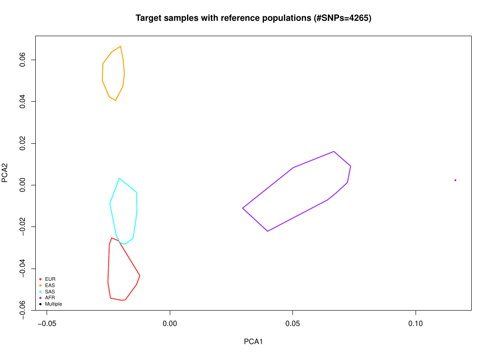
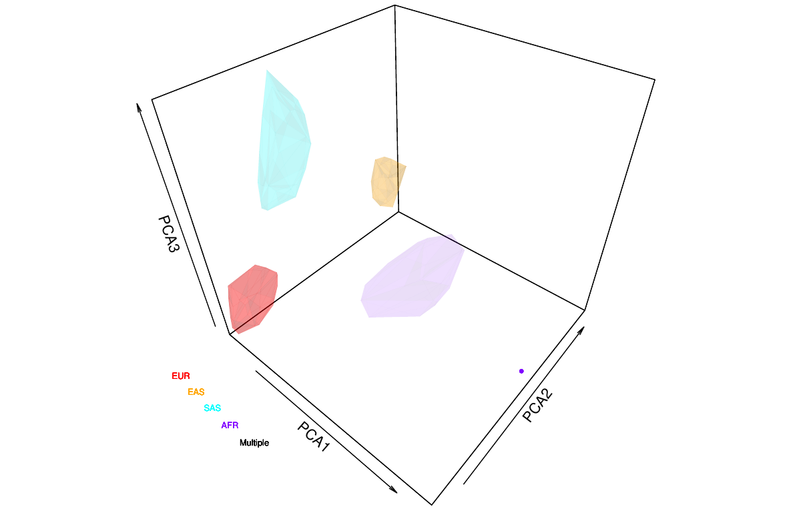
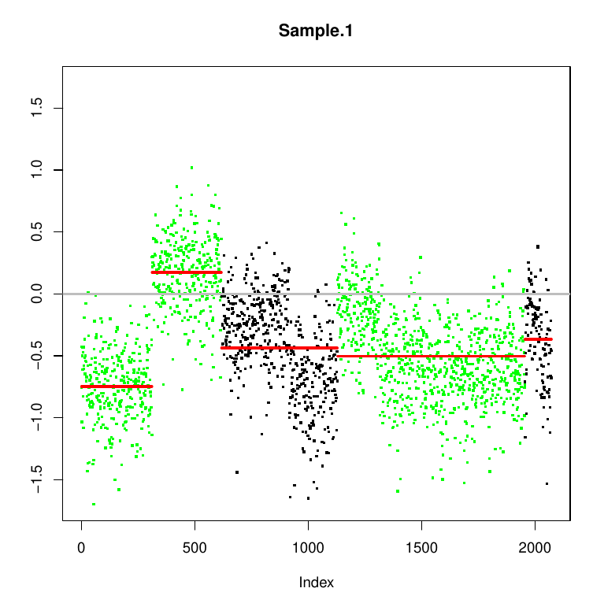
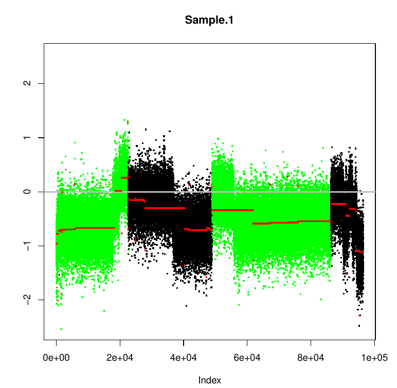

# **Project pipeline**

## **BAM pre-processing**

### **Sorting and indexing**
Sorting and indexing with samtool both for *Control.bam* and *Tumor.bam*

```bash
samtools sort input_files/Tumor.bam -o sorted_indexed_BAM/tumor.sorted.bam 

samtools index sorted_indexed_BAM/tumor.sorted.bam
```

flagstats for *control.sorted.bam :*

```
19720171 + 0 in total (QC-passed reads + QC-failed reads)
19708438 + 0 primary
11733 + 0 secondary
0 + 0 supplementary
0 + 0 duplicates
0 + 0 primary duplicates
19669924 + 0 mapped (99.75% : N/A)
19658191 + 0 primary mapped (99.75% : N/A)
19708438 + 0 paired in sequencing
9854219 + 0 read1
9854219 + 0 read2
19576046 + 0 properly paired (99.33% : N/A)
19613806 + 0 with itself and mate mapped
44385 + 0 singletons (0.23% : N/A)
16828 + 0 with mate mapped to a different chr
10030 + 0 with mate mapped to a different chr (mapQ>=5)
```

flagstats for *tumor.sorted.bam :*

```
15039503 + 0 in total (QC-passed reads + QC-failed reads)
15029250 + 0 primary
10253 + 0 secondary
0 + 0 supplementary
0 + 0 duplicates
0 + 0 primary duplicates
15033690 + 0 mapped (99.96% : N/A)
15023437 + 0 primary mapped (99.96% : N/A)
15029250 + 0 paired in sequencing
7514625 + 0 read1
7514625 + 0 read2
14979936 + 0 properly paired (99.67% : N/A)
15019614 + 0 with itself and mate mapped
3823 + 0 singletons (0.03% : N/A)
14070 + 0 with mate mapped to a different chr
7572 + 0 with mate mapped to a different chr (mapQ>=5)
```

Full statistics are in *tumor.stats.txt* and *control.stats.txt*

### **Filtering**

Both *control.sorted.bam* and *tumor.sorted.bam* have been filtered with samtools to meet the following criteria :

+ MAPQ over 30
+ Pass filters such as platform/vendor quality controls (flags)
+ being properly aligned according to the aligner

```bash
samtools view -q 30 -F 512 -f 2 -b control.sorted.bam > ../filtered_sorted_indexed_bam/filtered.control.sorted.bam
```

Doing so filtered out 23,11% of control reads (from 19.720.171 to 15.161.625) and 22.49% of tumor reads (from 15.039.503 to 11.656.539)

Filtered bam files were re-indexed.

### **Realignment around indels**

Realignment around indels was done with GATK using *human g1k v37* as reference genome and a list of known indels in *.vcf* format.

First the two *.intervarls* files are generated :

```bash
java -jar ../../tools/GenomeAnalysisTK.jar -T RealignerTargetCreator
    -R ../annotations/human_g1k_v37.fasta
    -I ../filtered_sorted_indexed_bam/filtered.control.sorted.bam 
    -known ../annotations/hg19_v0_1000G_phase1.snps.high_confidence.b37.vcf
    -o control.realigner.intervals

java -jar ../../tools/GenomeAnalysisTK.jar -T RealignerTargetCreator
    -R ../annotations/human_g1k_v37.fasta
    -I ../filtered_sorted_indexed_bam/filtered.tumor.sorted.bam 
    -known ../annotations/hg19_v0_1000G_phase1.snps.high_confidence.b37.vcf
    -o tumor.realigner.intervals
```

once the two *.intervals* are created, the actual realignment can be performed :

```bash
java -jar ../../tools/GenomeAnalysisTK.jar -T IndelRealigner
-R ../annotations/human_g1k_v37.fasta
-I ../filtered_sorted_indexed_bam/filtered.control.sorted.bam
-known ../annotations/hg19_v0_1000G_phase1.snps.high_confidence.b37.vcf
-targetIntervals control.realigner.intervals
-o realigned_filtered_control_sorted.bam

java -jar ../../tools/GenomeAnalysisTK.jar -T IndelRealigner
-R ../annotations/human_g1k_v37.fasta
-I ../filtered_sorted_indexed_bam/filtered.tumor.sorted.bam
-known ../annotations/hg19_v0_1000G_phase1.snps.high_confidence.b37.vcf
-targetIntervals tumor.realigner.intervals
-o realigned_filtered_tumor_sorted.bam
```

GATK realigned 8308 reads (~5%) in the control bam and 6655 (~6%) in the tumor bam.

### **Duplicate removal**

Duplicate removal was conducted with samtools.

As first step, the bam files are sorted by read name (needed by samtools fixmate)

```bash
samtools sort -n ../realigned_filtered_sorted_indexed_bam/realigned_filtered_control_sorted.bam -o nsorted_realigned_filtered_control_sorted.bam

samtools sort -n ../realigned_filtered_sorted_indexed_bam/realigned_filtered_tumor_sorted.bam -o nsorted_realigned_filtered_tumor_sorted.bam
```

Add mate tags when not present

```bash
samtools fixmate -m nsorted_realigned_filtered_control_sorted.bam fixed_realigned_filtered_control_sorted.bam

samtools fixmate -m nsorted_realigned_filtered_tumor_sorted.bam fixed_realigned_filtered_tumor_sorted.bam
```

Now we can re-sort the bam by coordinates and run the actual duplicate removal,

re-sorting :

```bash
samtools sort fixed_realigned_filtered_control_sorted.bam > fixed_realigned_filtered_control_re-sorted.bam

samtools sort fixed_realigned_filtered_tumor_sorted.bam > fixed_realigned_filtered_tumor_re-sorted.bam
```

duplicate removal :

```
samtools markdup -sr fixed_realigned_filtered_control_re-sorted.bam dedup_realigned_filtered_control.bam

samtools markdup -sr fixed_realigned_filtered_tumor_re-sorted.bam dedup_realigned_filtered_tumor.bam
```

This removed 2.074.733 duplicate reads in the control bam (~14%) leading to a total of 13.086.892 control, and 1.379.650 duplicate reads in the tumor bam (~12%) leading to a total of 10.276.889 tumor reads.

To compare the results, duplicate removal was also done using picard :

```
java -jar ../../tools/picard.jar MarkDuplicates I= ../realigned_filtered_sorted_indexed_bam/realigned_filtered_control_sorted.bam O=dedup_picard_realigned_filtered_control.bam REMOVE_DUPLICATES=true TMP_DIR=/tmp METRICS_FILE=control_picard.log ASSUME_SORTED=true

java -jar ../../tools/picard.jar MarkDuplicates I= ../realigned_filtered_sorted_indexed_bam/realigned_filtered_tumor_sorted.bam O=dedup_picard_realigned_filtered_tumor.bam REMOVE_DUPLICATES=true TMP_DIR=/tmp METRICS_FILE=tumor_picard.log ASSUME_SORTED=true
```
Similarly to samtools, Picard removed 2.070.030 (~13%) duplicate reads from the control bam and 1.376.758 (~12%) from the tumor bam.

Downstream analysis will be applied on the samtools deduplicated version.

### **Base quality score recalibration**

BQSR was done with GATK, first of all let's build the recalibration model using a list of high confidence known SNPs from [the Broad Institute public repository](https://console.cloud.google.com/storage/browser/gcp-public-data--broad-references/hg19/v0):

```
java -jar ../../tools/GenomeAnalysisTK.jar -T BaseRecalibrator
-R ../annotations/human_g1k_v37.fasta
-I ../dedup_realigned_sorted_indexed_bam/dedup_realigned_filtered_control.bam
-knownSites ../annotations/hg19_v0_1000G_phase1.snps.high_confidence.b37.vcf
-o control_recal_table

java -jar ../../tools/GenomeAnalysisTK.jar -T BaseRecalibrator
-R ../annotations/human_g1k_v37.fasta
-I ../dedup_realigned_sorted_indexed_bam/dedup_realigned_tumor.bam
-knownSites ../annotations/hg19_v0_1000G_phase1.snps.high_confidence.b37.vcf
-o tumor_recal_table
```

Once the recalibration tables are computed, the actual recalibration can be done : 

```
java -jar ../../tools/GenomeAnalysisTK.jar -T PrintReads -R ../annotations/human_g1k_v37.fasta
-I ../dedup_realigned_sorted_indexed_bam/dedup_realigned_control.bam
-BQSR control_recal_table
-o recal_dedup_real_filt_control.bam

java -jar ../../tools/GenomeAnalysisTK.jar -T PrintReads
-R ../annotations/human_g1k_v37.fasta
-I ../dedup_realigned_sorted_indexed_bam/dedup_realigned_tumor.bam
-BQSR tumor_recal_table
-o recal_dedup_real_filt_tumor.bam
```

Let's now recompute the recalibration table both for tumor and control in order to plot the before-after comparison

```bash
java -jar ../../tools/GenomeAnalysisTK.jar -T BaseRecalibrator
-R ../annotations/human_g1k_v37.fasta
-I recal_dedup_real_filt_control.bam
-knownSites ../annotations/hapmap_3.3.b37.vcf
-BQSR control_recal_table
-o after_control_recal_table

java -jar ../../tools/GenomeAnalysisTK.jar -T BaseRecalibrator
-R ../annotations/human_g1k_v37.fasta
-I recal_dedup_real_filt_tumor.bam
-knownSites ../annotations/hapmap_3.3.b37.vcf
-BQSR tumor_recal_table
-o after_tumor_recal_table
```

Now we can use the *AnalyzeCovariates* tool to plot the differences in the base qualities before and after recalibration

```bash
java -jar ../../tools/GenomeAnalysisTK.jar -T AnalyzeCovariates
-R ../annotations/human_g1k_v37.fasta
-before control_recal_table
-after after_control_recal_table
-plots control_recal_plots.pdf
-l DEBUG
-csv control_report.csv

java -jar ../../tools/GenomeAnalysisTK.jar -T AnalyzeCovariates
-R ../annotations/human_g1k_v37.fasta
-before tumor_recal_table
-after after_tumor_recal_table
-plots tumor_recal_plots.pdf
-l DEBUG
-csv tumor_report.csv
```
## Variant calling

The variant calling process aims at characterizing the genotype of the samples and identify variants 

```bash
java -jar ../../tools/GenomeAnalysisTK.jar -T UnifiedGenotyper
-R ../annotations/human_g1k_v37.fasta
-I ../recal_dedup_realigned_sorted_indexed_bam/recal_dedup_real_filt_control.bam
-o control_GATK.vcf

java -jar ../../tools/GenomeAnalysisTK.jar -T UnifiedGenotyper
-R ../annotations/human_g1k_v37.fasta
-I ../recal_dedup_realigned_sorted_indexed_bam/recal_dedup_real_filt_tumor.bam
-o tumor_GATK.vcf
```

once the two *.vcf* files are generated we can filter them with vcftools in order to keep only high quality calls

```bash
vcftools --minQ 20 --max-meanDP 100 --min-meanDP 5 --remove-indels --vcf control_GATK.vcf --out control_GATK_filtered_calls --recode --recode-INFO-all

vcftools --minQ 20 --max-meanDP 100 --min-meanDP 5 --remove-indels --vcf tumor_GATK.vcf --out tumor_GATK_filtered_calls --recode --recode-INFO-all
```

the filtering kept 34397 out of 152088 possible sites in the control and 31645 out of possible 152502 sites.

## Variant annotation

To link variants to specific genotypes we need to annotate our *.vcf* files.

In order to do this we'll use SnpEff and SnpSift.

SnpEff will output a annotated *.vcf* file and a *html* file with a summary of the annotation

```bash
java -Xmx2g -jar ../../tools/snpEff/snpEff.jar -v hg19kg ../variant_calling/control_GATK_filtered_calls.recode.vcf -s control.html > control_snpeff_ann.vcf

java -Xmx2g -jar ../../tools/snpEff/snpEff.jar -v hg19kg ../variant_calling/tumor_GATK_filtered_calls.recode.vcf -s tumor.html > tumor_snpeff_ann.vcf
```

with the output from SnpEff we can run another round of annotation with SnpSift to get more detail and accurate annotations about cancer from specific databases like Clinvar and HapMap.

HapMap:

```bash
java -Xmx4g -jar ../../tools/snpEff/SnpSift.jar Annotate ../annotations/hapmap_3.3.b37.vcf  control_snpeff_ann.vcf > control_ann_hapmap.vcf

java -Xmx4g -jar ../../tools/snpEff/SnpSift.jar Annotate ../annotations/hapmap_3.3.b37.vcf  tumor_snpeff_ann.vcf > tumor_ann_hapmap.vcf
```

ClinVar:

```bash
java -Xmx4g -jar ../../tools/snpEff/SnpSift.jar Annotate ../annotations/clinvar_Pathogenic.vcf  control_ann_hapmap.vcf > control_ann_hapmap_clinvar.vcf

java -Xmx4g -jar ../../tools/snpEff/SnpSift.jar Annotate ../annotations/clinvar_Pathogenic.vcf  tumor_ann_hapmap.vcf > tumor_ann_hapmap_clinvar.vcf
```
Annotations can now be filtered to only retrieve annotation calls that have a high impact and quality over 20

```bash
cat control_ann_hapmap_clinvar.vcf | java -jar ../../tools/snpEff/SnpSift.jar filter " ( QUAL >= 20 ) & ( ANN[ANY].IMPACT = 'HIGH')" > control_ann_filtered.vcf

cat tumor_ann_hapmap_clinvar.vcf | java -jar ../../tools/snpEff/SnpSift.jar filter " ( QUAL >= 20 ) & ( ANN[ANY].IMPACT = 'HIGH')" > tumor_ann_filtered.vcf
```
This retain 43 SNPs for both control and tumor samples.

## Ancestry analysis

Ancestry analysis are performed using EthSeq, a tool for ethnicity annotation

```R
library(EthSEQ)

ethseq.Analysis(
  target.vcf = "../variant_annotation/control_ann_hapmap_clinvar.vcf",
  out.dir = "./control/",
  model.gds = "./ReferenceModel.gds",
  cores=1,
  verbose=TRUE,
  composite.model.call.rate = 0.99,
  space="3D")

ethseq.Analysis(
  target.vcf = "../variant_annotation/tumor_ann_hapmap_clinvar.vcf",
  out.dir = "./tumor/",
  model.gds = "./ReferenceModel.gds",
  cores=1,
  verbose=TRUE,
  composite.model.call.rate = 0.99,
  space="3D")
```





AFR	CLOSEST	EUR(20.05%)|EAS(19.35%)|SAS(17.99%)|AFR(42.61%)

The results of the PCA suggest that the patient could be of African ethnicity.

## Somatic variant calling

To call somatic variants we'll rum a pileup on our pre-processed *.bam* files to later identify somatic events with VarScan

```bash
samtools mpileup -q 1 -f ../annotations/human_g1k_v37.fasta ../recal_dedup_realigned_sorted_indexed_bam/recal_dedup_real_filt_control.bam > control.pileup

samtools mpileup -q 1 -f ../annotations/human_g1k_v37.fasta ../recal_dedup_realigned_sorted_indexed_bam/recal_dedup_real_filt_tumor.bam > tumor.pileup
```

once the pileup is performed the *.pileup* files can be fed to VarScan, using as thresholds for heterozigosis and homozigosis 0.2 and 0.8

```bash
java -jar ../../tools/VarScan.v2.3.9.jar somatic control.pileup tumor.pileup --output-snp somatic.pm --output-indel somatic.indel --output-vcf 1 --min-var-freq 0.2 --min-freq-for-hom 0.8
```

as we can see from the results 

```
89758156 positions in tumor
89554858 positions shared in normal
17619950 had sufficient coverage for comparison
17595037 were called Reference
0 were mixed SNP-indel calls and filtered
21278 were called Germline
3223 were called LOH
325 were called Somatic
87 were called Unknown
0 were called Variant
```

VarScan has found 325 variants that were called somatic but when retrieving them from the *.vcf* file (INFO SS=2) only 242 are retrieved

``` bash
cat somatic.pm.vcf | java -jar ../../tools/snpEff/SnpSift.jar filter "( SS = '2' )" > somatic_variants.vcf

bcftools stats somatic_variants.vcf

# SN    [2]id   [3]key  [4]value
SN      0       number of samples:      2
SN      0       number of records:      242
SN      0       number of no-ALTs:      0
SN      0       number of SNPs: 242
SN      0       number of MNPs: 0
SN      0       number of indels:       0
SN      0       number of others:       0
SN      0       number of multiallelic sites:   0
SN      0       number of multiallelic SNP sites:       0
```

also grepping lines containing "SS=2" return the same result

```bash
cat somatic.pm.vcf | grep "SS=2" | wc -l

242
```
## Somatic variant annotation

Now that somatic variants have been identified we can annotate them and generate an *.html* summary for web view

```bash
java -Xmx4g -jar ../../tools/snpEff/snpEff.jar -v hg19kg ../somatic_variant_calling/somatic_variants.vcf -s somatic_variant_ann.html > somatic_variant_ann.vcf
```

## Somatic copy number variation

To detect CNVs we need to generate a pileup of the regions of interest as indicated in the *.bed* files and feed them as imput to varscan-copynumber

```bash
samtools mpileup -q 1 -f ../annotations/human_g1k_v37.fasta ../recal_dedup_realigned_sorted_indexed_bam/recal_dedup_real_filt_control.bam ../recal_dedup_realigned_sorted_indexed_bam/recal_dedup_real_filt_tumor.bam -l DNA_Repair_Genes.bed | java -jar ../../tools/VarScan.v2.3.9.jar copynumber --output-file SCNA --mpileup 1

samtools mpileup -q 1 -f ../annotations/human_g1k_v37.fasta ../recal_dedup_realigned_sorted_indexed_bam/recal_dedup_real_filt_control.bam ../recal_dedup_realigned_sorted_indexed_bam/recal_dedup_real_filt_tumor.bam -l Captured_Regions.bed | java -jar ../../tools/VarScan.v2.3.9.jar copynumber --output-file SCNA --mpileup 1
```

use the copy number optained from varscan copynumber to find copy number variants

```bash
java -jar ../../tools/VarScan.v2.3.9.jar copyCaller SCNA_copynumber_captured_regions --output-file SCNA_copynumber_captured_regions_called

java -jar ../../tools/VarScan.v2.3.9.jar copyCaller SCNA_copynumber_DNA_repair --output-file SCNA_copynumber_DNA_repair_called
```

segmentation for DNA repair genes


segmentation for captured regions


## Tumor purity and ploidy